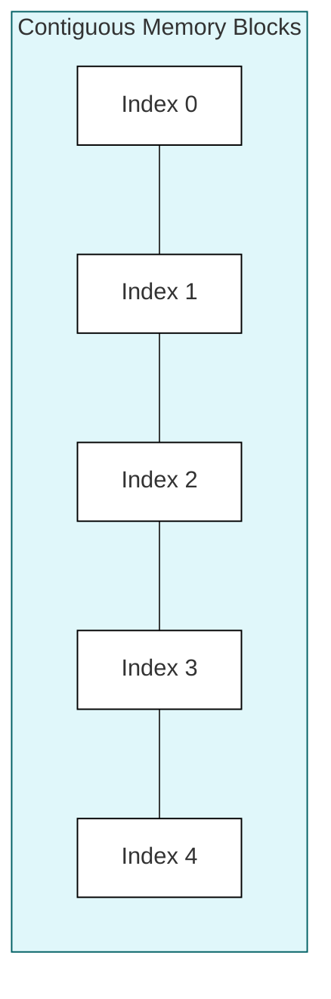

# Arrays

An array is a collection of items of the same type stored in contiguous memory locations.

## Declaring Arrays

You can declare an array by specifying the type of the elements and the size of the array.

```cpp
type array_name[array_size];
```

### Example

```cpp
int numbers[5]; // an array of 5 integers
```

### Visualization




## Initializing Arrays

You can initialize an array at the time of declaration.

```cpp
int numbers[5] = {10, 20, 30, 40, 50};
```

If you provide fewer initializers than the size of the array, the remaining elements are initialized to zero.

```cpp
int numbers[5] = {10, 20}; // numbers will be {10, 20, 0, 0, 0}
```

You can also omit the size of the array if you provide an initializer list. The compiler will automatically determine the size.

```cpp
int numbers[] = {10, 20, 30, 40, 50}; // size is 5
```

## Accessing Array Elements

You can access an element of an array using its index. Array indices start from 0.

```cpp
int numbers[] = {10, 20, 30, 40, 50};
int first_element = numbers[0]; // 10
int third_element = numbers[2]; // 30
```

You can also modify an element of an array using its index.

```cpp
numbers[0] = 100; // the first element is now 100
```

## Multidimensional Arrays

You can have arrays of arrays, which are known as multidimensional arrays.

### Example: 2D Array

```cpp
int matrix[3][3] = {
    {1, 2, 3},
    {4, 5, 6},
    {7, 8, 9}
};

int element = matrix[1][1]; // 5
```

## Passing Arrays to Functions

When you pass an array to a function, it is passed as a pointer to the first element. This means that any changes made to the array inside the function will affect the original array.

```cpp
#include <iostream>

void print_array(int arr[], int size) {
    for (int i = 0; i < size; ++i) {
        std::cout << arr[i] << " ";
    }
    std::cout << std::endl;
}

int main() {
    int numbers[] = {1, 2, 3, 4, 5};
    print_array(numbers, 5);
    return 0;
}
```

## `std::array` (C++11 and later)

C++11 introduced `std::array`, which is a container that encapsulates fixed-size arrays. It provides some advantages over C-style arrays, such as bounds checking and iterators.

```cpp
#include <iostream>
#include <array>

int main() {
    std::array<int, 5> numbers = {10, 20, 30, 40, 50};

    for (int number : numbers) {
        std::cout << number << " ";
    }
    std::cout << std::endl;

    std::cout << "Size: " << numbers.size() << std::endl;
    std::cout << "Element at index 2: " << numbers.at(2) << std::endl;

    return 0;
}
```
We will learn more about containers like `std::array` and `std::vector` in the STL section.
