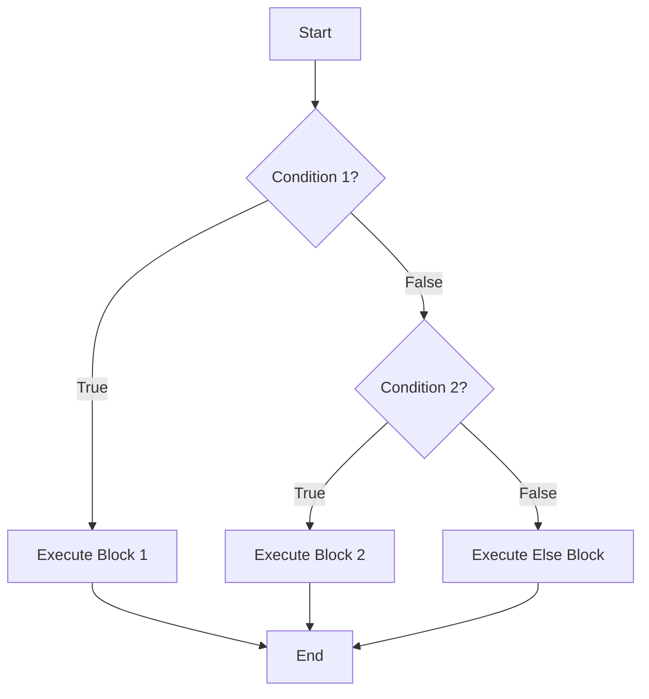

# `if-else` Statement

The `if-else` statement is used to execute a block of code based on a condition.

## Flowchart representation




## `if` Statement

The `if` statement executes a block of code if a specified condition is true.

```cpp
if (condition) {
    // block of code to be executed if the condition is true
}
```

### Example

```cpp
#include <iostream>

int main() {
    int x = 20;
    if (x > 10) {
        std::cout << "x is greater than 10" << std::endl;
    }
    return 0;
}
```

## `else` Statement

The `else` statement is used to execute a block of code if the condition in the `if` statement is false.

```cpp
if (condition) {
    // block of code to be executed if the condition is true
} else {
    // block of code to be executed if the condition is false
}
```

### Example

```cpp
#include <iostream>

int main() {
    int x = 5;
    if (x > 10) {
        std::cout << "x is greater than 10" << std::endl;
    } else {
        std::cout << "x is not greater than 10" << std::endl;
    }
    return 0;
}
```

## `else if` Statement

The `else if` statement is used to specify a new condition if the first condition is false.

```cpp
if (condition1) {
    // block of code to be executed if condition1 is true
} else if (condition2) {
    // block of code to be executed if condition1 is false and condition2 is true
} else {
    // block of code to be executed if both condition1 and condition2 are false
}
```

### Example

```cpp
#include <iostream>

int main() {
    int x = 10;
    if (x > 10) {
        std::cout << "x is greater than 10" << std::endl;
    } else if (x < 10) {
        std::cout << "x is less than 10" << std::endl;
    } else {
        std::cout << "x is equal to 10" << std::endl;
    }
    return 0;
}
```
