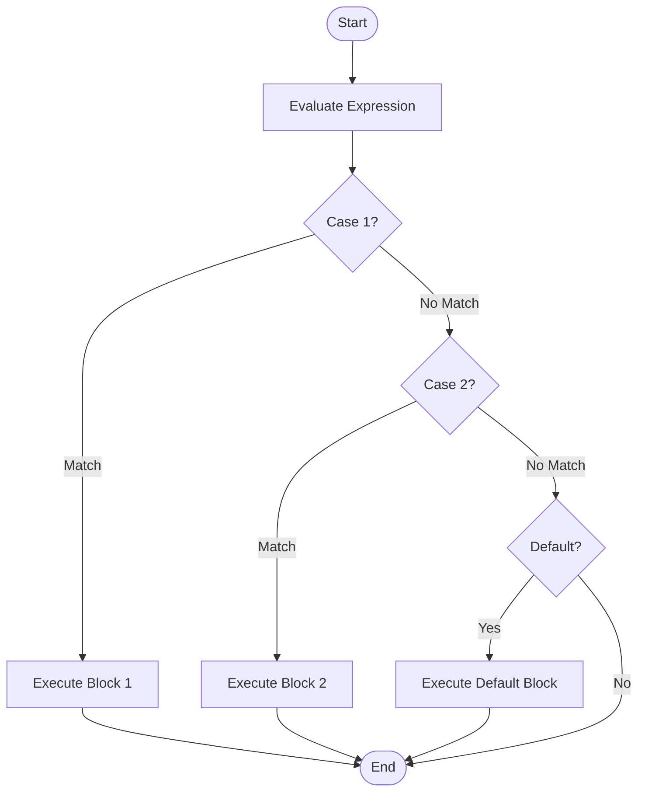

# `switch` Statement

The `switch` statement is used to select one of many code blocks to be executed.

## Flowchart representation




## Syntax

```cpp
switch (expression) {
    case constant1:
        // code to be executed if expression is equal to constant1
        break;
    case constant2:
        // code to be executed if expression is equal to constant2
        break;
    ...
    default:
        // code to be executed if expression is not equal to any of the constants
}
```

### How it works:

1.  The `expression` is evaluated once.
2.  The value of the expression is compared with the values of each `case`.
3.  If there is a match, the associated block of code is executed.
4.  The `break` statement is used to jump out of the `switch` block. If `break` is omitted, execution will "fall through" to the next `case`.
5.  The `default` statement is optional and specifies some code to be run if there is no case match.

### Example

```cpp
#include <iostream>

int main() {
    int day = 4;
    switch (day) {
        case 1:
            std::cout << "Monday" << std::endl;
            break;
        case 2:
            std::cout << "Tuesday" << std::endl;
            break;
        case 3:
            std::cout << "Wednesday" << std::endl;
            break;
        case 4:
            std::cout << "Thursday" << std::endl;
            break;
        case 5:
            std::cout << "Friday" << std::endl;
            break;
        case 6:
            std::cout << "Saturday" << std::endl;
            break;
        case 7:
            std::cout << "Sunday" << std::endl;
            break;
        default:
            std::cout << "Invalid day" << std::endl;
    }
    return 0;
}
```

## Fall-Through

If you omit the `break` statement, the execution will continue to the next `case`.

### Example of Fall-Through

```cpp
#include <iostream>

int main() {
    int day = 4;
    switch (day) {
        case 1:
        case 2:
        case 3:
        case 4:
        case 5:
            std::cout << "Weekday" << std::endl;
            break;
        case 6:
        case 7:
            std::cout << "Weekend" << std::endl;
            break;
        default:
            std::cout << "Invalid day" << std::endl;
    }
    return 0;
}
```
