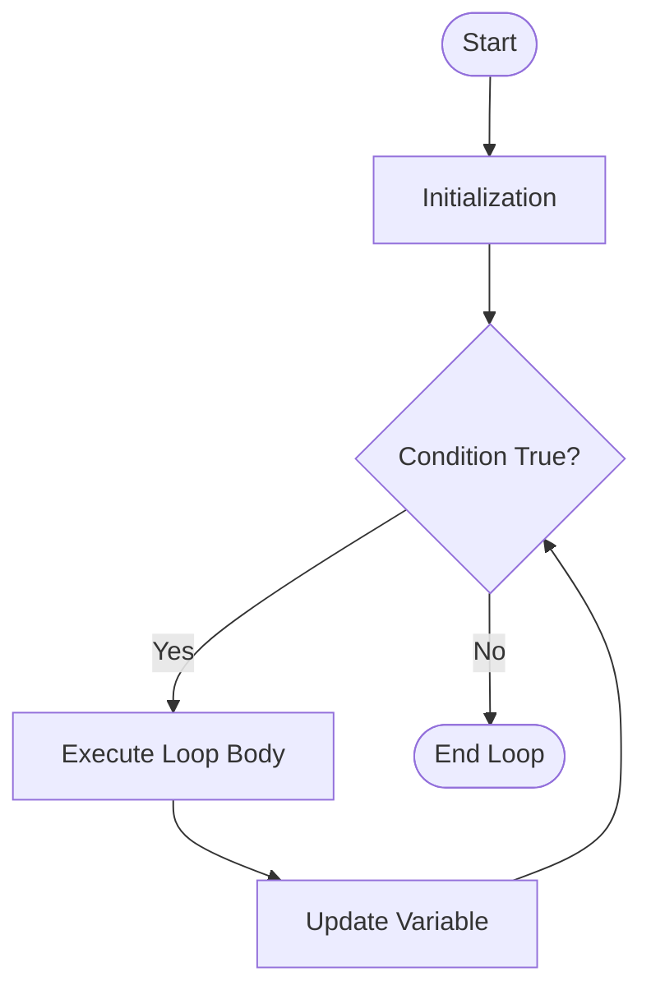

# `for` Loop

The `for` loop is used to execute a block of code a specified number of times.

## Flowchart representation




## Syntax

```cpp
for (initialization; condition; update) {
    // code to be executed
}
```

*   **initialization:** Executed once before the loop starts. Used to initialize loop variables.
*   **condition:** Checked before each iteration. If it is true, the loop continues; otherwise, the loop terminates.
*   **update:** Executed at the end of each iteration. Used to update the loop variables.

### Example

```cpp
#include <iostream>

int main() {
    for (int i = 0; i < 5; ++i) {
        std::cout << "i = " << i << std::endl;
    }
    return 0;
}
```

## Range-Based `for` Loop (C++11 and later)

The range-based `for` loop is a more convenient way to iterate over a range of values, such as the elements of an array or a container.

### Syntax

```cpp
for (declaration : range) {
    // code to be executed
}
```

*   **declaration:** A declaration of a variable that will hold the elements of the range, one by one.
*   **range:** The range of values to iterate over (e.g., an array, a vector).

### Example

```cpp
#include <iostream>
#include <vector>

int main() {
    int numbers[] = {1, 2, 3, 4, 5};

    // Using a traditional for loop
    for (int i = 0; i < 5; ++i) {
        std::cout << numbers[i] << " ";
    }
    std::cout << std::endl;

    // Using a range-based for loop
    for (int number : numbers) {
        std::cout << number << " ";
    }
    std::cout << std::endl;

    std::vector<int> vec = {6, 7, 8, 9, 10};
    for (int val : vec) {
        std::cout << val << " ";
    }
    std::cout << std::endl;

    return 0;
}
```

You can use the `&` symbol to get a reference to the element, which can be more efficient for large objects and allows you to modify the elements of the range.

```cpp
std::vector<int> vec = {1, 2, 3};
for (int& val : vec) {
    val *= 2; // double each element
}
```
