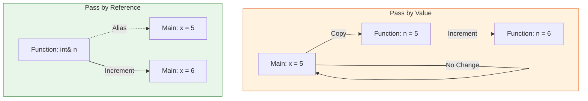

# Function Parameters

Function parameters are the variables listed in the function's declaration and definition. They are used to pass information to the function.

## Pass by Value

By default, arguments in C++ are passed by value. This means that a copy of the argument is passed to the function. Any changes made to the parameter inside the function do not affect the original argument.

### Example

```cpp
#include <iostream>

void increment(int n) {
    n++;
    std::cout << "Inside function: n = " << n << std::endl;
}

int main() {
    int x = 5;
    increment(x);
    std::cout << "Outside function: x = " << x << std::endl;
    return 0;
}
```

Output:
```
Inside function: n = 6
Outside function: x = 5
```

As you can see, the value of `x` is not changed by the `increment` function.

## Pass by Reference

To modify the original argument, you can pass it by reference. A reference is an alias for an existing variable. To pass a variable by reference, you use the `&` symbol.

### Example

```cpp
#include <iostream>

void increment(int& n) {
    n++;
    std::cout << "Inside function: n = " << n << std::endl;
}

int main() {
    int x = 5;
    increment(x);
    std::cout << "Outside function: x = " << x << std::endl;
    return 0;
}
```

Output:
```
Inside function: n = 6
Outside function: x = 6
```

Now, the value of `x` is changed by the `increment` function.

### Visualization




## Pass by Pointer

You can also pass arguments by pointer. A pointer is a variable that stores the memory address of another variable.

### Example

```cpp
#include <iostream>

void increment(int* n) {
    (*n)++;
    std::cout << "Inside function: n = " << *n << std::endl;
}

int main() {
    int x = 5;
    increment(&x); // pass the address of x
    std::cout << "Outside function: x = " << x << std::endl;
    return 0;
}
```

Output:
```
Inside function: n = 6
Outside function: x = 6
```

We will discuss pointers in more detail in a later section.

## Default Arguments

You can provide default values for function parameters. If a value is not provided for a parameter when the function is called, the default value is used.

### Example

```cpp
#include <iostream>

void print(int value, int base = 10) {
    // code to print the value in the given base
    std::cout << "Value: " << value << " (base " << base << ")" << std::endl;
}

int main() {
    print(100);       // uses default base 10
    print(255, 16);   // specifies base 16
    return 0;
}
```

Output:
```
Value: 100 (base 10)
Value: 255 (base 16)
```

Default arguments must be at the end of the parameter list.
