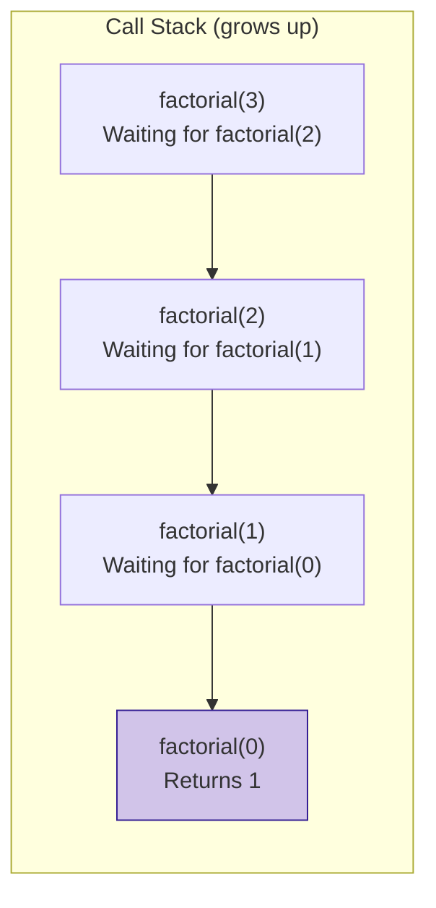

# Recursion

Recursion is a programming technique where a function calls itself.

## How it works

A recursive function must have two parts:

1.  **Base Case:** A condition that stops the recursion. Without a base case, the function would call itself indefinitely, leading to a stack overflow.
2.  **Recursive Step:** The part of the function that calls itself.

### Example: Factorial

The factorial of a number can be calculated using recursion.

*   `n! = n * (n-1)!`
*   Base case: `0! = 1`

```cpp
#include <iostream>

long long factorial(int n) {
    if (n == 0) { // base case
        return 1;
    } else { // recursive step
        return n * factorial(n - 1);
    }
}

int main() {
    int number = 5;
    std::cout << "Factorial of " << number << " is " << factorial(number) << std::endl;
    return 0;
}
```

### How `factorial(3)` works:

1.  `factorial(3)` calls `factorial(2)`
2.  `factorial(2)` calls `factorial(1)`
3.  `factorial(1)` calls `factorial(0)`
4.  `factorial(0)` returns `1`
5.  `factorial(1)` returns `1 * 1 = 1`
6.  `factorial(2)` returns `2 * 1 = 2`
7.  `factorial(3)` returns `3 * 2 = 6`

### Call Stack Visualization




## Recursion vs. Iteration

Any problem that can be solved with recursion can also be solved with iteration (using loops).

| Recursion                               | Iteration                                |
|-----------------------------------------|------------------------------------------|
| Code is often shorter and more elegant. | Code can be longer and more complex.     |
| Can be slower due to function call overhead. | Can be faster.                           |
| Can lead to stack overflow for deep recursion. | Does not have the risk of stack overflow. |

For problems that are naturally recursive (e.g., tree traversal, divide and conquer algorithms), recursion can be a more intuitive and readable solution. However, for simple problems like factorial, an iterative solution is usually more efficient.
