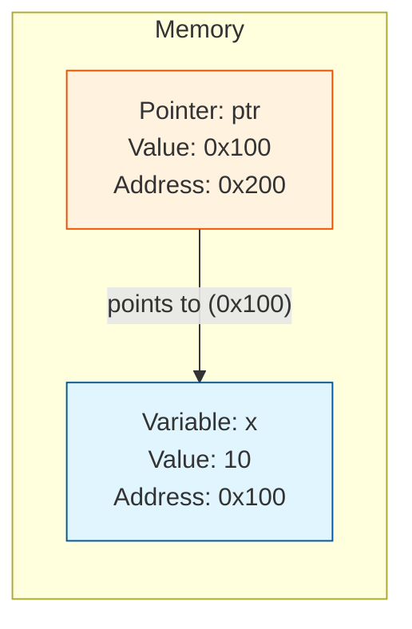

# Pointers

A pointer is a variable that stores the memory address of another variable.

## Declaring Pointers

You can declare a pointer by using the `*` symbol.

```cpp
type* pointer_name;
```

### Example

```cpp
int* ptr; // a pointer to an integer
double* d_ptr; // a pointer to a double
```

## Address-of Operator (`&`)

The `&` operator returns the memory address of a variable.

```cpp
int x = 10;
int* ptr = &x; // ptr now holds the address of x
```

## Dereference Operator (`*`)

The `*` operator is used to access the value at the address stored in a pointer. This is called dereferencing.

```cpp
int x = 10;
int* ptr = &x;

std::cout << *ptr << std::endl; // prints 10
*ptr = 20; // changes the value of x to 20
std::cout << x << std::endl; // prints 20
```

### Visualization




### Example

```cpp
#include <iostream>

int main() {
    int var = 20;
    int* ptr = &var;

    std::cout << "Value of var: " << var << std::endl;
    std::cout << "Address of var: " << &var << std::endl;
    std::cout << "Value of ptr: " << ptr << std::endl;
    std::cout << "Value at the address stored in ptr: " << *ptr << std::endl;

    return 0;
}
```

## Null Pointers

A null pointer is a pointer that does not point to any memory location. It is good practice to initialize a pointer to `nullptr` if you are not assigning it a specific address.

```cpp
int* ptr = nullptr;
```

Dereferencing a null pointer will cause a runtime error.

## Pointers to Pointers

You can have a pointer that points to another pointer.

```cpp
int x = 10;
int* ptr1 = &x;
int** ptr2 = &ptr1;

std::cout << "Value of x: " << x << std::endl;
std::cout << "Value at *ptr1: " << *ptr1 << std::endl;
std::cout << "Value at **ptr2: " << **ptr2 << std::endl;
```

Pointers are a powerful feature of C++, but they can also be dangerous if not used correctly. Common errors include dereferencing null or uninitialized pointers, and memory leaks. In modern C++, it is often better to use smart pointers, which we will discuss in the "Memory Management" section.
