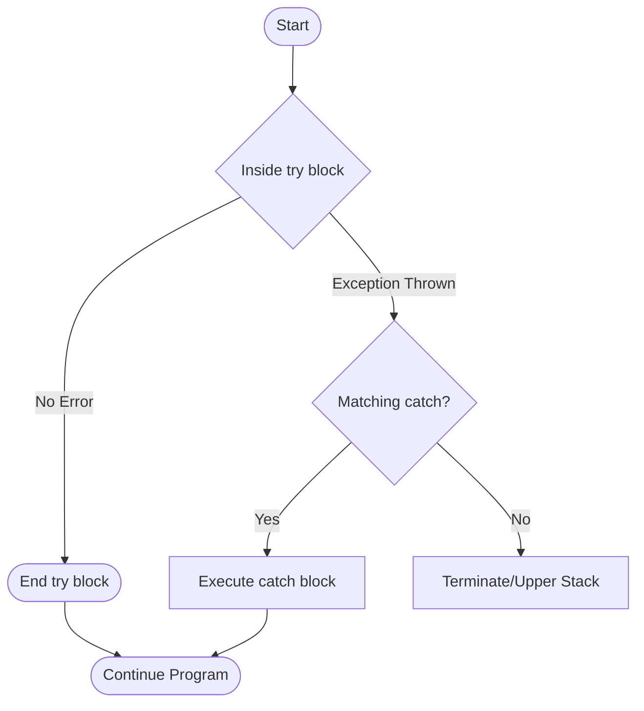

# `try`, `catch`, and `throw`

Exception handling is a mechanism in C++ that allows you to handle errors or exceptional situations that occur at runtime. It is based on three keywords: `try`, `catch`, and `throw`.

## `throw`

When an error occurs, you can "throw" an exception. The `throw` keyword is used for this purpose. You can throw a value of any type, including primitive types, C-style strings, or class objects.

```cpp
double divide(int a, int b) {
    if (b == 0) {
        throw "Division by zero!";
    }
    return static_cast<double>(a) / b;
}
```

## `try` and `catch`

To handle exceptions, you use a `try-catch` block.

*   **`try` block:** The code that might throw an exception is placed inside a `try` block.
*   **`catch` block:** If an exception is thrown in the `try` block, the program looks for a matching `catch` block to handle it.

### Flowchart representation




### Syntax

```cpp
try {
    // code that might throw an exception
} catch (ExceptionType1 e1) {
    // code to handle ExceptionType1
} catch (ExceptionType2 e2) {
    // code to handle ExceptionType2
} catch (...) {
    // code to handle any other type of exception
}
```

*   You can have multiple `catch` blocks to handle different types of exceptions.
*   The `catch(...)` block is a "catch-all" block that will catch any type of exception. It should be placed at the end.

### Example

```cpp
#include <iostream>

double divide(int a, int b) {
    if (b == 0) {
        throw "Division by zero!";
    }
    return static_cast<double>(a) / b;
}

int main() {
    try {
        double result = divide(10, 0);
        std::cout << "Result: " << result << std::endl;
    } catch (const char* msg) {
        std::cerr << "Error: " << msg << std::endl;
    }

    std::cout << "Program continues..." << std::endl;

    return 0;
}
```
Output:
```
Error: Division by zero!
Program continues...
```
Without the `try-catch` block, the program would have terminated when the exception was thrown.

## Stack Unwinding

When an exception is thrown, the function call stack is "unwound". The program looks for a `catch` block in the current function. If one is not found, it exits the current function and looks for a `catch` block in the calling function, and so on, up the call stack.

During this process, the destructors of any local objects that go out of scope are called. This is why the RAII idiom is so important for exception safety.
