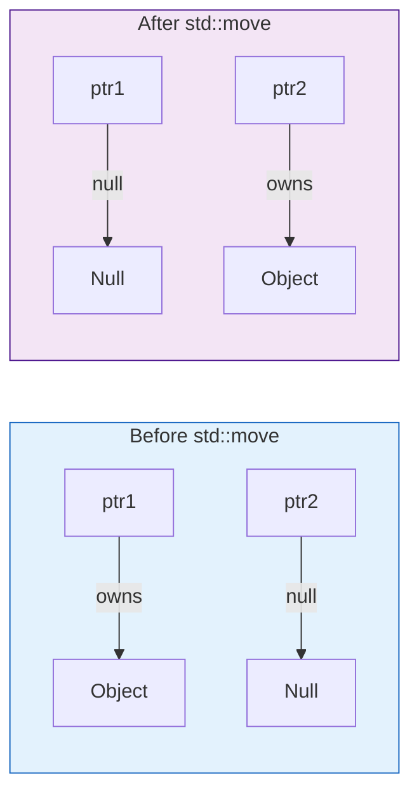

# `std::unique_ptr`

`std::unique_ptr` is a smart pointer that owns and manages another object through a pointer and disposes of that object when the `unique_ptr` goes out of scope.

As the name implies, `unique_ptr` has **unique ownership**. This means that only one `unique_ptr` can point to a given object at a time.

## Creating a `unique_ptr`

The recommended way to create a `unique_ptr` is with `std::make_unique` (since C++14).

```cpp
#include <memory>

class MyClass { ... };

// Create a unique_ptr to a MyClass object
auto ptr = std::make_unique<MyClass>();
```

If you are using C++11, you can create a `unique_ptr` like this:

```cpp
std::unique_ptr<MyClass> ptr(new MyClass());
```
`std::make_unique` is preferred because it is safer in certain complex expressions.

## Using a `unique_ptr`

A `unique_ptr` can be used like a regular pointer with the `*` and `->` operators.

```cpp
ptr->myMethod();
(*ptr).someProperty = 42;
```

## Transferring Ownership

You cannot copy a `unique_ptr`, because that would violate the unique ownership principle.

```cpp
auto ptr1 = std::make_unique<MyClass>();
// auto ptr2 = ptr1; // Error: cannot copy a unique_ptr
```

However, you can **move** a `unique_ptr` to transfer ownership.

```cpp
auto ptr1 = std::make_unique<MyClass>();
auto ptr2 = std::move(ptr1); // ptr2 now owns the object, ptr1 is now nullptr
```

### Visualization




This is useful for returning a `unique_ptr` from a function.

```cpp
std::unique_ptr<MyClass> create_object() {
    return std::make_unique<MyClass>();
}

int main() {
    auto my_ptr = create_object();
    // my_ptr now owns the object created in the function
    return 0;
} // my_ptr goes out of scope, and the object is automatically deleted
```

## `unique_ptr` for Arrays

`unique_ptr` can also be used to manage dynamically allocated arrays.

```cpp
// Create a unique_ptr to an array of 10 integers
auto arr_ptr = std::make_unique<int[]>(10);

// Access elements
arr_ptr[0] = 100;
```
When `arr_ptr` goes out of scope, it will automatically call `delete[]` on the array.

## When to use `unique_ptr`

`std::unique_ptr` should be your default choice for managing dynamically allocated resources. It is lightweight and has the same performance as a raw pointer. Use it when you want to express exclusive ownership of a resource.
