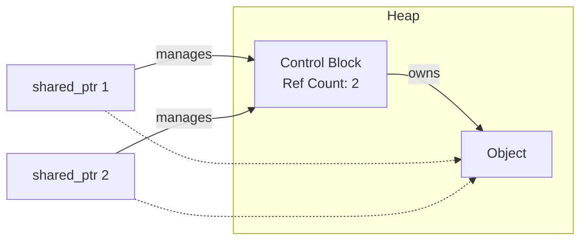

# `std::shared_ptr`

`std::shared_ptr` is a smart pointer that retains shared ownership of an object through a pointer. Several `shared_ptr` objects may own the same object.

## How it works: Reference Counting

`std::shared_ptr` uses a technique called **reference counting**. It maintains a "control block" that stores a reference count, which is the number of `shared_ptr`s that are currently pointing to the object.

*   When a new `shared_ptr` is created to point to the object, the reference count is incremented.
*   When a `shared_ptr` is destroyed or reassigned, the reference count is decremented.
*   When the reference count becomes zero, the object is automatically deleted.

### Visualization




## Creating a `shared_ptr`

Similar to `unique_ptr`, the recommended way to create a `shared_ptr` is with `std::make_shared` (since C++11).

```cpp
#include <memory>

class MyClass { ... };

// Create a shared_ptr to a MyClass object
auto ptr = std::make_shared<MyClass>();
```
`std::make_shared` is more efficient than creating a `shared_ptr` with `new` because it can allocate the memory for the object and the control block in a single allocation.

## Copying and Assigning `shared_ptr`

You can freely copy and assign `shared_ptr`s.

```cpp
auto ptr1 = std::make_shared<MyClass>();
auto ptr2 = ptr1; // Both ptr1 and ptr2 now own the object
                 // The reference count is 2

std::cout << "Use count: " << ptr1.use_count() << std::endl; // prints 2
```

When `ptr2` goes out of scope, the reference count becomes 1. When `ptr1` goes out of scope, the reference count becomes 0, and the object is deleted.

### Example

```cpp
#include <iostream>
#include <memory>

class MyClass {
public:
    MyClass() { std::cout << "MyClass constructed" << std::endl; }
    ~MyClass() { std::cout << "MyClass destructed" << std::endl; }
};

int main() {
    std::shared_ptr<MyClass> ptr1;
    {
        auto ptr2 = std::make_shared<MyClass>();
        std::cout << "Use count: " << ptr2.use_count() << std::endl; // 1
        ptr1 = ptr2;
        std::cout << "Use count: " << ptr1.use_count() << std::endl; // 2
    } // ptr2 goes out of scope, ref count is 1

    std::cout << "Use count: " << ptr1.use_count() << std::endl; // 1
    return 0;
} // ptr1 goes out of scope, ref count is 0, object is destructed
```

## When to use `shared_ptr`

Use `std::shared_ptr` when you need to share ownership of a resource. For example:

*   When you want to store pointers to objects in multiple places (e.g., in different data structures).
*   When you are passing a pointer to a function and you are not sure about the lifetime of the object.

However, `shared_ptr` has some overhead compared to `unique_ptr` (due to the reference counting), so you should prefer `unique_ptr` when unique ownership is sufficient.

One potential issue with `shared_ptr` is **circular references**, which can lead to memory leaks. This is where `std::weak_ptr` comes in.
