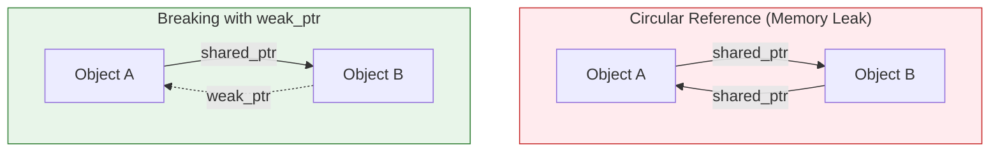

# `std::weak_ptr`

`std::weak_ptr` is a smart pointer that holds a non-owning ("weak") reference to an object that is managed by a `std::shared_ptr`. It is used to break circular dependencies between `std::shared_ptr`s.

## The Problem: Circular References

A circular reference occurs when two or more objects have `shared_ptr`s to each other.

### Example

```cpp
#include <iostream>
#include <memory>

struct B; // forward declaration

struct A {
    std::shared_ptr<B> b_ptr;
    ~A() { std::cout << "A destructed" << std::endl; }
};

struct B {
    std::shared_ptr<A> a_ptr;
    ~B() { std::cout << "B destructed" << std::endl; }
};

int main() {
    auto a = std::make_shared<A>();
    auto b = std::make_shared<B>();

    a->b_ptr = b;
    b->a_ptr = a;

    std::cout << "a use count: " << a.use_count() << std::endl; // 2
    std::cout << "b use count: " << b.use_count() << std::endl; // 2

    return 0;
} // a and b go out of scope, but their destructors are not called!
```
In this example, when `a` and `b` go out of scope, their reference counts are still 1 (because `b->a_ptr` points to `a` and `a->b_ptr` points to `b`). As a result, the objects are never destroyed, and we have a memory leak.

## The Solution: `std::weak_ptr`

`std::weak_ptr` does not affect the reference count of the object it points to. To solve the circular reference problem, one of the `shared_ptr`s in the cycle should be replaced with a `weak_ptr`.

### Visualization




### Example with `weak_ptr`

```cpp
#include <iostream>
#include <memory>

struct B;

struct A {
    std::shared_ptr<B> b_ptr;
    ~A() { std::cout << "A destructed" << std::endl; }
};

struct B {
    std::weak_ptr<A> a_ptr; // use a weak_ptr here
    ~B() { std::cout << "B destructed" << std::endl; }
};

int main() {
    auto a = std::make_shared<A>();
    auto b = std::make_shared<B>();

    a->b_ptr = b;
    b->a_ptr = a;

    return 0;
} // now the destructors are called correctly
```
Now, when `a` and `b` go out of scope, `a`'s reference count becomes 1 (from `b->a_ptr`), but `b`'s reference count becomes 0. So, `b` is destroyed. The destruction of `b` destroys `b->a_ptr`, which causes `a`'s reference count to become 0. So, `a` is also destroyed.

## Using a `weak_ptr`

You cannot access the object directly through a `weak_ptr`. To access the object, you must first convert the `weak_ptr` to a `shared_ptr` by calling the `lock()` method.

```cpp
std::weak_ptr<MyClass> weak;
// ...
if (auto shared = weak.lock()) { // get a shared_ptr from the weak_ptr
    // use shared here
} else {
    // the object has been destroyed
}
```
`lock()` returns a `shared_ptr` to the object if it still exists, and an empty `shared_ptr` otherwise. This is a safe way to check if the object is still valid before trying to access it.
