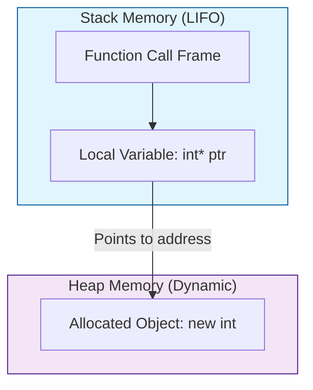

# Stack vs. Heap

In C++, memory is divided into two main parts: the stack and the heap.

## Visualization




## The Stack

*   **What it is:** The stack is a region of memory where local variables are stored.
*   **How it works:** It's a LIFO (Last-In, First-Out) data structure. When a function is called, a "stack frame" is created for that function, which holds its local variables. When the function returns, the stack frame is destroyed.
*   **Memory Management:** Managed automatically by the compiler. You don't have to worry about allocating or deallocating stack memory.
*   **Size:** The stack is relatively small (typically a few MB).
*   **Speed:** Allocation and deallocation on the stack is very fast.

### Example of Stack Allocation

```cpp
void myFunction() {
    int x = 10; // x is allocated on the stack
    // ...
} // x is automatically deallocated when the function ends
```

## The Heap

*   **What it is:** The heap is a large pool of memory that can be used for dynamic allocation.
*   **How it works:** It's a more flexible region of memory. You can allocate a block of memory of any size, and it will remain allocated until you explicitly deallocate it.
*   **Memory Management:** Managed manually by the programmer using `new` and `delete` (or automatically using smart pointers).
*   **Size:** The heap is much larger than the stack. Its size is limited by the amount of available virtual memory.
*   **Speed:** Allocation and deallocation on the heap is slower than on the stack.

### Example of Heap Allocation

```cpp
void myFunction() {
    int* ptr = new int; // ptr is on the stack, but it points to an integer on the heap
    // ...
    delete ptr; // you must remember to deallocate the memory
}
```

## Stack vs. Heap: Key Differences

| Feature             | Stack                                       | Heap                                        |
|---------------------|---------------------------------------------|---------------------------------------------|
| **Memory Management** | Automatic (by compiler)                     | Manual (by programmer) or via smart pointers |
| **Lifetime**        | Limited to the scope of the function/block  | Persists until explicitly deallocated       |
| **Size**            | Small and fixed                               | Large and dynamic                             |
| **Speed**           | Fast allocation and deallocation            | Slower allocation and deallocation          |
| **Use for...**      | Local variables, function call information  | Dynamic data structures, large objects      |

## When to use Stack vs. Heap

*   **Use the stack** for small, fixed-size variables with a limited lifetime. This is the default and should be preferred whenever possible.

*   **Use the heap** when you need:
    *   To allocate a large amount of memory.
    *   The variable to exist beyond the scope of the current function.
    *   To create dynamic data structures like linked lists, trees, etc.

In modern C++, the use of raw pointers with `new` and `delete` is discouraged. Instead, you should use smart pointers or STL containers, which handle memory management automatically and help prevent common errors like memory leaks.
