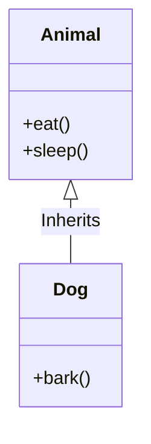

# Inheritance

Inheritance is one of the key features of Object-Oriented Programming. It allows you to create a new class (the **derived class**) from an existing class (the **base class**). The derived class inherits the attributes and methods of the base class.

## Class Diagram




## Why use Inheritance?

*   **Code Reusability:** You can reuse the code from the base class without having to write it again.
*   **"is-a" Relationship:** Inheritance represents an "is-a" relationship. For example, a `Dog` "is-a" `Animal`.

## Syntax

```cpp
class DerivedClass : access_specifier BaseClass {
    // ...
};
```

*   **`access_specifier`:** Can be `public`, `protected`, or `private`. It determines how the members of the base class are inherited. We will discuss this in the next section. If omitted, it is `private` by default for classes.

### Example

```cpp
#include <iostream>
#include <string>

// Base class
class Animal {
public:
    void eat() {
        std::cout << "I can eat!" << std::endl;
    }
    void sleep() {
        std::cout << "I can sleep!" << std::endl;
    }
};

// Derived class
class Dog : public Animal {
public:
    void bark() {
        std::cout << "I can bark! Woof woof!!" << std::endl;
    }
};

int main() {
    Dog myDog;
    myDog.eat();   // inherited from Animal
    myDog.sleep(); // inherited from Animal
    myDog.bark();  // own method

    return 0;
}
```

In this example, the `Dog` class inherits the `eat()` and `sleep()` methods from the `Animal` class.

## Types of Inheritance

*   **Single Inheritance:** A class inherits from only one base class.
*   **Multiple Inheritance:** A class inherits from more than one base class.
*   **Multilevel Inheritance:** A class inherits from a derived class, making it a "grandchild" of the original base class.
*   **Hierarchical Inheritance:** Multiple classes inherit from a single base class.
*   **Hybrid Inheritance:** A combination of two or more types of inheritance.

C++ supports all of these types of inheritance.
