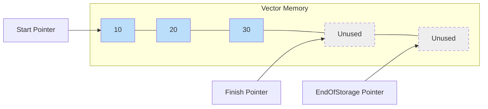

# `std::vector`

`std::vector` is a sequence container that represents a dynamic array. It can grow and shrink in size as needed.

To use `std::vector`, you need to include the `<vector>` header.

## Creating a Vector

```cpp
#include <vector>

std::vector<int> vec1; // empty vector of integers
std::vector<int> vec2 = {1, 2, 3, 4, 5};
std::vector<int> vec3(5, 10); // a vector of 5 integers, all with the value 10
```

## Common Operations

### Adding Elements

*   `push_back()`: Adds an element to the end of the vector.
*   `insert()`: Inserts an element at a specified position.

```cpp
std::vector<int> vec = {1, 2, 3};
vec.push_back(4); // vec is now {1, 2, 3, 4}
vec.insert(vec.begin() + 1, 99); // vec is now {1, 99, 2, 3, 4}
```

### Accessing Elements

*   `[]`: Access an element by index (no bounds checking).
*   `at()`: Access an element by index (with bounds checking).
*   `front()`: Access the first element.
*   `back()`: Access the last element.

```cpp
std::vector<int> vec = {10, 20, 30};
int a = vec[0]; // 10
int b = vec.at(1); // 20
int c = vec.front(); // 10
int d = vec.back(); // 30
```

### Removing Elements

*   `pop_back()`: Removes the last element.
*   `erase()`: Removes an element or a range of elements.
*   `clear()`: Removes all elements.

```cpp
std::vector<int> vec = {1, 2, 3, 4, 5};
vec.pop_back(); // vec is now {1, 2, 3, 4}
vec.erase(vec.begin() + 1); // vec is now {1, 3, 4}
vec.clear(); // vec is now empty
```

### Size and Capacity

*   `size()`: Returns the number of elements in the vector.
*   `capacity()`: Returns the number of elements the vector can hold before it needs to reallocate memory.
*   `empty()`: Returns `true` if the vector is empty.
*   `resize()`: Changes the size of the vector.
*   `reserve()`: Requests a change in capacity.

### Visualization




### Example

```cpp
#include <iostream>
#include <vector>

int main() {
    std::vector<int> vec;
    vec.push_back(10);
    vec.push_back(20);
    vec.push_back(30);

    std::cout << "Vector elements: ";
    for (int i = 0; i < vec.size(); ++i) {
        std::cout << vec[i] << " ";
    }
    std::cout << std::endl;

    std::cout << "Using range-based for loop: ";
    for (int x : vec) {
        std::cout << x << " ";
    }
    std::cout << std::endl;

    return 0;
}
```

`std::vector` is one of the most commonly used containers in C++ due to its flexibility and performance.
