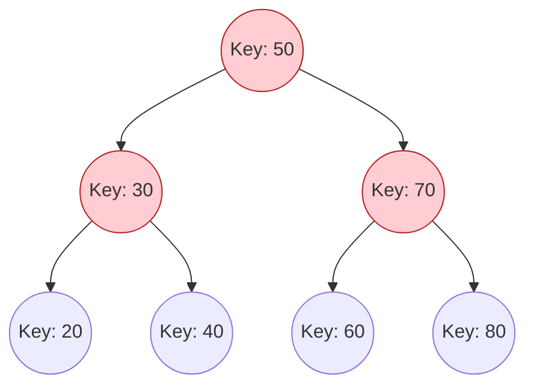

# `std::map`

`std::map` is an associative container that stores elements in a mapped fashion. Each element has a key value and a mapped value. No two mapped values can have the same key values.

The keys in a `std::map` are sorted. Internally, `std::map` is usually implemented as a red-black tree, which allows for fast search, insertion, and deletion (O(log n)).

### Visualization (Tree Structure)




To use `std::map`, you need to include the `<map>` header.

## Creating a Map

```cpp
#include <map>
#include <string>

std::map<std::string, int> ages; // map from string to int
```

## Common Operations

### Inserting Elements

You can insert elements into a map in several ways:

*   Using `insert()`:

    ```cpp
    ages.insert(std::make_pair("Alice", 30));
    ages.insert({"Bob", 25});
    ```

*   Using the `[]` operator:

    ```cpp
    ages["Charlie"] = 35;
    ```
    If the key already exists, this will update the corresponding value. If it doesn't exist, it will be created.

### Accessing Elements

*   Using the `[]` operator:

    ```cpp
    std::cout << ages["Alice"] << std::endl;
    ```
    **Warning:** If the key does not exist, this will create a new element with a default-constructed value.

*   Using `at()`:

    ```cpp
    std::cout << ages.at("Bob") << std::endl;
    ```
    This provides bounds checking and will throw an `std::out_of_range` exception if the key does not exist.

*   Using `find()`:

    ```cpp
    auto it = ages.find("David");
    if (it != ages.end()) {
        std::cout << "David's age is " << it->second << std::endl;
    } else {
        std::cout << "David not found." << std::endl;
    }
    ```
    `find()` returns an iterator to the element if found, or an iterator to `ages.end()` if not found.

### Removing Elements

*   `erase()`: Removes an element by key, by position (iterator), or a range of elements.

    ```cpp
    ages.erase("Charlie");
    ```

### Iterating through a Map

You can iterate through a map using a range-based for loop. Each element is a `std::pair`.

```cpp
for (const auto& pair : ages) {
    std::cout << pair.first << ": " << pair.second << std::endl;
}
```

### Example

```cpp
#include <iostream>
#include <map>
#include <string>

int main() {
    std::map<std::string, int> student_scores;

    student_scores["Alice"] = 95;
    student_scores["Bob"] = 88;
    student_scores["Charlie"] = 92;

    std::cout << "Bob's score: " << student_scores["Bob"] << std::endl;

    student_scores["Alice"] = 96; // update a value

    for (const auto& pair : student_scores) {
        std::cout << pair.first << " scored " << pair.second << std::endl;
    }

    return 0;
}
```

## `std::unordered_map` (C++11 and later)

C++11 introduced `std::unordered_map`, which is similar to `std::map` but is implemented using a hash table. This results in faster average case performance for insertion, deletion, and search (O(1)), but the elements are not sorted.
