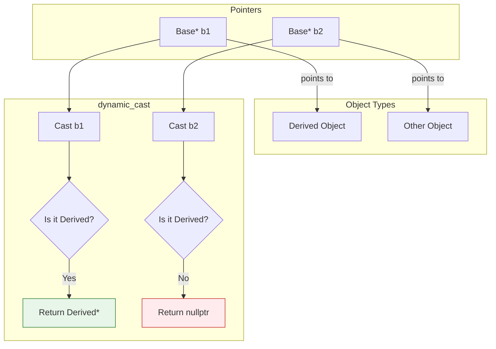

# dynamic_cast

`dynamic_cast` is used for **safe downcasting** in inheritance hierarchies. Unlike `static_cast`, it performs **runtime type checking**.

## Syntax

```cpp
dynamic_cast<target_type>(expression)
```

## Requirements

`dynamic_cast` only works with **polymorphic types** (classes with at least one virtual function).

```cpp
// This class is NOT polymorphic
class NonPoly {
    int x;
};

// This class IS polymorphic (has virtual function)
class Poly {
    virtual void foo() {}  // Makes it polymorphic
};
```

## How It Works

`dynamic_cast` uses **Runtime Type Information (RTTI)** to check if the cast is valid.

### With Pointers: Returns `nullptr` on Failure

```cpp
#include <iostream>

class Base {
public:
    virtual ~Base() {}  // Makes Base polymorphic
};

class Derived : public Base {
public:
    void derivedMethod() {
        std::cout << "Derived method called" << std::endl;
    }
};

class Other : public Base {};

int main() {
    Base* b1 = new Derived();
    Base* b2 = new Other();

    // Safe downcast - succeeds
    Derived* d1 = dynamic_cast<Derived*>(b1);
    if (d1) {
        d1->derivedMethod();  // Works!
    }

    // Safe downcast - fails (b2 points to Other, not Derived)
    Derived* d2 = dynamic_cast<Derived*>(b2);
    if (d2) {
        d2->derivedMethod();
    } else {
        std::cout << "Cast failed, d2 is nullptr" << std::endl;
    }

    delete b1;
    delete b2;
    return 0;
}
```

### Visualization



```

### With References: Throws `std::bad_cast` on Failure

```cpp
#include <iostream>
#include <typeinfo>

class Base {
public:
    virtual ~Base() {}
};

class Derived : public Base {};

void process(Base& b) {
    try {
        Derived& d = dynamic_cast<Derived&>(b);
        std::cout << "Cast succeeded" << std::endl;
    } catch (const std::bad_cast& e) {
        std::cout << "Cast failed: " << e.what() << std::endl;
    }
}

int main() {
    Derived d;
    Base b;

    process(d);  // Cast succeeded
    process(b);  // Cast failed: std::bad_cast

    return 0;
}
```

## Use Cases

### 1. Safe Downcasting

```cpp
void processShape(Shape* shape) {
    if (Circle* c = dynamic_cast<Circle*>(shape)) {
        std::cout << "Processing circle with radius " << c->getRadius();
    } else if (Rectangle* r = dynamic_cast<Rectangle*>(shape)) {
        std::cout << "Processing rectangle " << r->getWidth() << "x" << r->getHeight();
    }
}
```

### 2. Cross-casting in Multiple Inheritance

```cpp
class A {
public:
    virtual ~A() {}
};

class B {
public:
    virtual ~B() {}
};

class C : public A, public B {};

int main() {
    C c;
    A* a = &c;

    // Cross-cast from A* to B* (both are bases of C)
    B* b = dynamic_cast<B*>(a);  // Works! Returns valid pointer

    return 0;
}
```

### 3. Checking Object Type

```cpp
void identify(Base* obj) {
    if (dynamic_cast<Derived1*>(obj)) {
        std::cout << "It's Derived1" << std::endl;
    } else if (dynamic_cast<Derived2*>(obj)) {
        std::cout << "It's Derived2" << std::endl;
    } else {
        std::cout << "Unknown type" << std::endl;
    }
}
```

## Performance Considerations

`dynamic_cast` has **runtime overhead** because it needs to:
1. Access the virtual table (vtable)
2. Traverse the inheritance hierarchy
3. Perform type comparisons

```cpp
// Prefer this pattern for performance-critical code:
if (Derived* d = dynamic_cast<Derived*>(base)) {
    // Use d multiple times here
    d->method1();
    d->method2();
}

// Instead of:
dynamic_cast<Derived*>(base)->method1();  // Cast twice
dynamic_cast<Derived*>(base)->method2();  // Inefficient
```

## Common Patterns

### The "Safe Cast and Use" Pattern

```cpp
// C++17 if with initializer
if (auto* derived = dynamic_cast<Derived*>(base); derived != nullptr) {
    derived->specificMethod();
}

// Pre-C++17
if (Derived* derived = dynamic_cast<Derived*>(base)) {
    derived->specificMethod();
}
```

### Visitor Pattern Alternative

When you find yourself using many `dynamic_cast`s, consider the Visitor pattern instead:

```cpp
// Instead of:
void process(Shape* s) {
    if (auto* c = dynamic_cast<Circle*>(s)) { /*...*/ }
    else if (auto* r = dynamic_cast<Rectangle*>(s)) { /*...*/ }
}

// Consider:
class ShapeVisitor {
public:
    virtual void visit(Circle& c) = 0;
    virtual void visit(Rectangle& r) = 0;
};
```

## When NOT to Use dynamic_cast

1. **When you KNOW the exact type** - use `static_cast`
2. **In performance-critical loops** - redesign with virtual functions
3. **With non-polymorphic types** - won't compile
4. **Excessive use** - often indicates design problems

## Disabling RTTI

Some projects disable RTTI for binary size/performance. In that case, `dynamic_cast` won't work.

```bash
g++ -fno-rtti program.cpp  # RTTI disabled
```

## Key Takeaways

- Only works with polymorphic types (need virtual function)
- Pointer cast returns `nullptr` on failure
- Reference cast throws `std::bad_cast` on failure
- Has runtime overhead (uses RTTI)
- Can perform cross-casts in multiple inheritance
- Excessive use may indicate design issues

## Common Interview Questions

> [!question]- Why does dynamic_cast require a polymorphic type?
> It uses the vtable to access RTTI (Runtime Type Information). Without at least one virtual function, there's no vtable and no RTTI.

> [!question]- What's the performance cost of dynamic_cast?
> It involves vtable lookup and type hierarchy traversal. Typically small but measurable. For tight loops, prefer virtual function dispatch or redesign.

> [!question]- How is dynamic_cast different from static_cast for downcasting?
> `static_cast` performs no runtime check—if wrong, you get UB. `dynamic_cast` checks at runtime and returns nullptr/throws on failure.

## Related Topics

- [[01_static_cast|static_cast]]
- [[../OOP_Deep_Dive/01_vtable_and_vptr|Virtual Tables (vtable)]]
- [[../Object-Oriented_Programming/Polymorphism/02_virtual_functions|Virtual Functions]]
